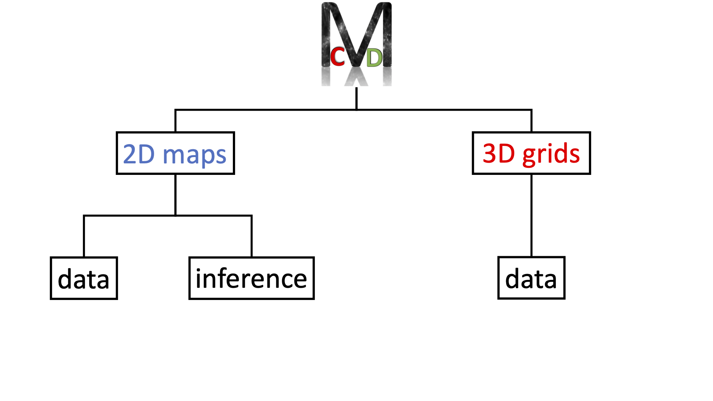

Download
========

All CMC data is hosted in the Rusty cluster of the `Flatiron Institute <https://www.simonsfoundation.org/flatiron>`_, and can be downloaded in two different ways:

- Via `globus <https://app.globus.org/file-manager?origin_id=2be3b3c6-d752-11eb-8131-bbca43030bb4&origin_path=%2F>`_.
- Via `url <https://users.flatironinstitute.org/~fvillaescusa/priv/v0lBajuAlt1am6RxCiK0u0Whe9J20/CMC>`_.

While with the url the transfer is simple and convenient, it can be slow and unstable. We recommend using globus as it is the fastest and more reliable way to transfer the data.

Structure
---------

CMC data is organized as follows:

- **2D\_maps**. This folder contains 2 subfolders:
  
  - data. All files with the images and the value of the cosmological and astrophysical parameters are here.

  - benchmark. Contains all scripts used to train and test the networks together with the network weights themselves.
    
- **3D\_grids**. This folder only contains 1 subfolder:

  - data. All files with the 3D grids and the value of the cosmological and astrophysical parameters are here.

The image below shows a scheme with the data organization.
    

