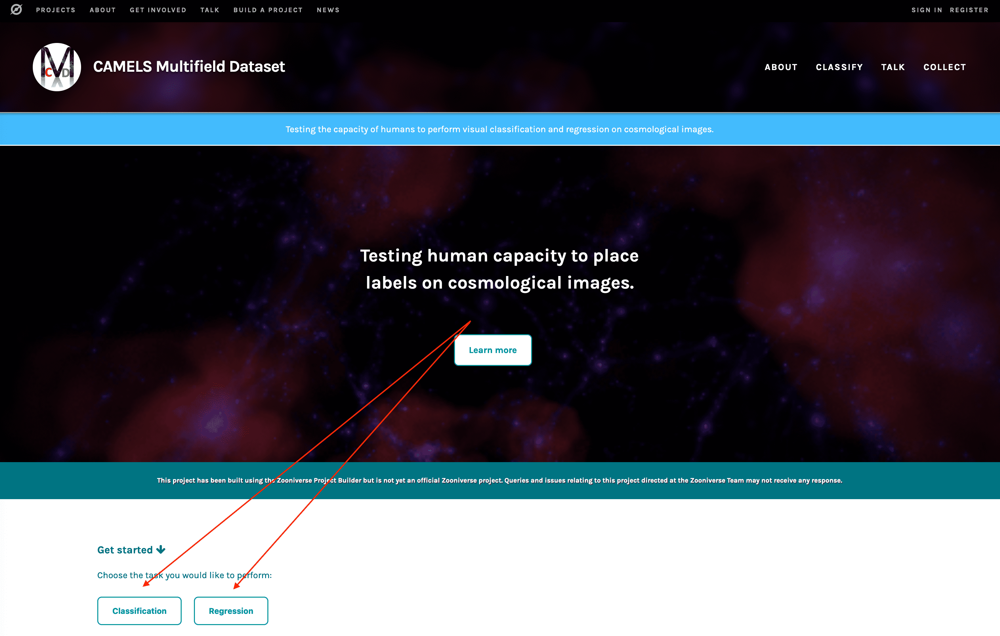
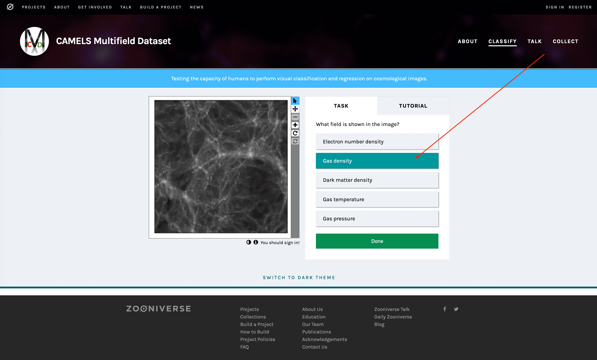
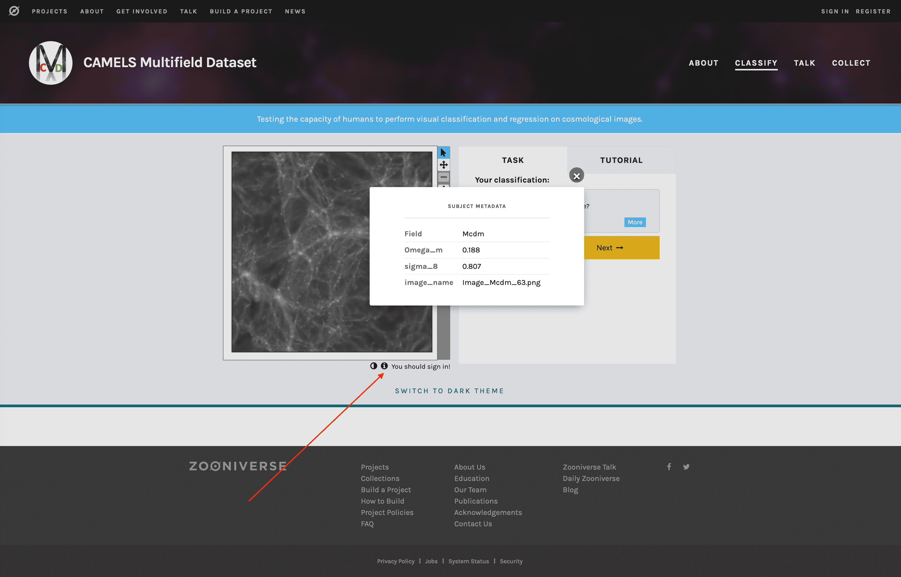
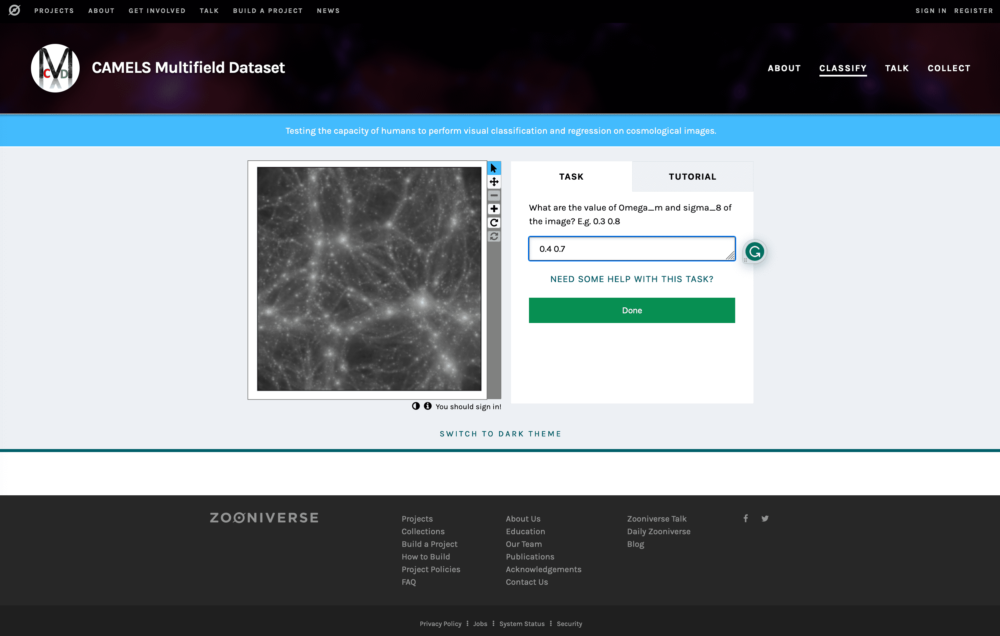
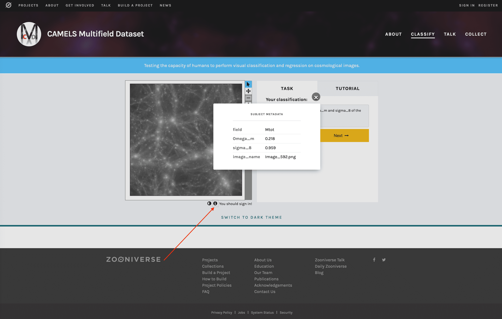

.. _game:

====
Game
====

Do you want to test your classification and regression capabilities?
We have created an app using CMD data where the user can guess

1) the field an image represent (classification)
2) the value of the cosmological parameters of an image (regression)

You can find the game `here <https://www.zooniverse.org/projects/fvillaescusa/camels-multifield-dataset>`_ that is hosted by the `Zooniverse <https://www.zooniverse.org/>`_ platform.

Classification
~~~~~~~~~~~~~~

.. raw:: html

   

   <gradio-app src="https://fvillaescusa-camels-fields.hf.space"></gradio-app>

	 

Alternatively, go to the `game website <https://www.zooniverse.org/projects/fvillaescusa/camels-multifield-dataset>`_ and click on the classification buttom:

Take a look at the image shown and click on the field you think it represents:

- Dark matter density
- Gas density
- Gas temperature
- Gas pressure
- Electron number density

Click on the Done buttom. Next, click on the information buttom to see the true label

.. Note::

   It is possible to see the true label before selecting the field. Keep in mind that this is designed as a game whose main purpose is to train a user to perform these tasks.

Regression
~~~~~~~~~~

Go to the `game website <https://www.zooniverse.org/projects/fvillaescusa/camels-multifield-dataset>`_ and click on the regression buttom:

Take a look at the image shown and write the value of :math:`Omega_{\rm m}` and :math:`\sigma_8` you think the image has.

Click on the Done buttom. Next, click on the information buttom to see the true values of the parameters

.. Note::

   It is possible to see the true labels before selecting the field. Keep in mind that this is designed as a game whose main purpose is to train a user to perform these tasks.
